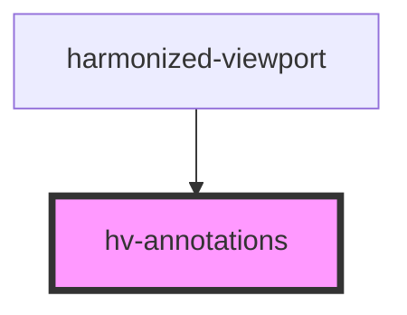

# hv-annotations

<!-- Auto Generated Below -->

## Dependencies

### Used by

 - [harmonized-viewport](../viewport-component)

### Graph

----------------------------------------------

*Built with [StencilJS](https://stenciljs.com/)*
