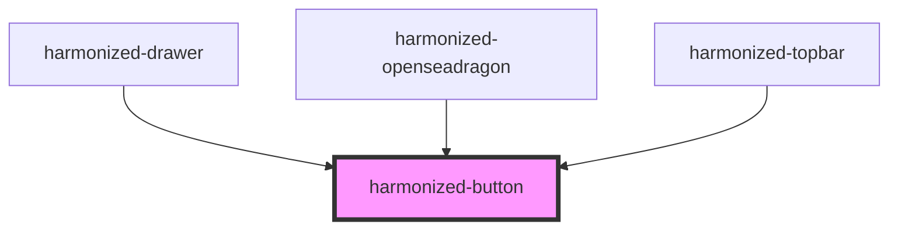

# harmonized-button

<!-- Auto Generated Below -->

## Properties

| Property        | Attribute         | Description | Type      | Default     |
| --------------- | ----------------- | ----------- | --------- | ----------- |
| `disabled`      | `disabled`        |             | `boolean` | `undefined` |
| `dropdown`      | `dropdown`        |             | `boolean` | `undefined` |
| `fullWidth`     | `full-width`      |             | `boolean` | `undefined` |
| `icon`          | `icon`            |             | `string`  | `undefined` |
| `iconClassName` | `icon-class-name` |             | `string`  | `undefined` |
| `label`         | `label`           |             | `string`  | `undefined` |
| `outline`       | `outline`         |             | `boolean` | `undefined` |
| `raised`        | `raised`          |             | `boolean` | `undefined` |
| `size`          | `size`            |             | `string`  | `undefined` |
| `tooltip`       | `tooltip`         |             | `string`  | `undefined` |

## Dependencies

### Used by

 - [harmonized-drawer](../drawer)
 - [harmonized-openseadragon](../openseadragon)
 - [harmonized-topbar](../topbar)

### Graph

----------------------------------------------

*Built with [StencilJS](https://stenciljs.com/)*
