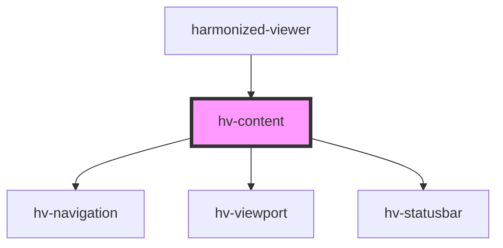

# hv-content

<!-- Auto Generated Below -->

## Properties

| Property     | Attribute | Description | Type                      | Default     |
| ------------ | --------- | ----------- | ------------------------- | ----------- |
| `navigation` | --        |             | `HTMLHvNavigationElement` | `undefined` |

## Dependencies

### Used by

 - [harmonized-viewer](../viewer-component)

### Depends on

- [hv-navigation](../navigation-component)
- [hv-viewport](../viewport-component)
- [hv-statusbar](../statusbar)

### Graph

----------------------------------------------

*Built with [StencilJS](https://stenciljs.com/)*
