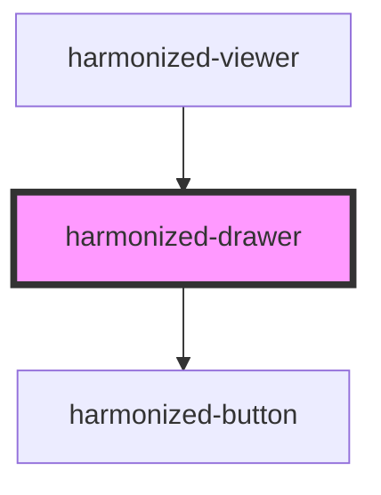

# harmonized-drawer

<!-- Auto Generated Below -->

## Properties

| Property      | Attribute      | Description | Type      | Default     |
| ------------- | -------------- | ----------- | --------- | ----------- |
| `headerTitle` | `header-title` |             | `string`  | `undefined` |
| `shown`       | `shown`        |             | `boolean` | `false`     |

## Events

| Event                | Description | Type               |
| -------------------- | ----------- | ------------------ |
| `viewerDrawerToggle` |             | `CustomEvent<any>` |

## Dependencies

### Used by

 - [harmonized-viewer](../viewer-component)

### Depends on

- [harmonized-button](../button)

### Graph

----------------------------------------------

*Built with [StencilJS](https://stenciljs.com/)*
