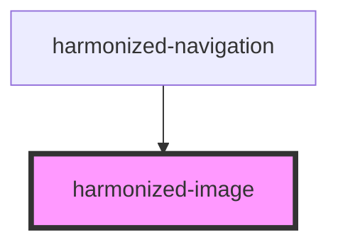

# harmonized-image

<!-- Auto Generated Below -->

## Properties

| Property      | Attribute      | Description | Type      | Default     |
| ------------- | -------------- | ----------- | --------- | ----------- |
| `caption`     | `caption`      |             | `string`  | `""`        |
| `contentType` | `content-type` |             | `string`  | `undefined` |
| `page`        | `page`         |             | `number`  | `undefined` |
| `preload`     | `preload`      |             | `boolean` | `false`     |
| `showCaption` | `show-caption` |             | `boolean` | `undefined` |
| `showTooltip` | `show-tooltip` |             | `boolean` | `undefined` |
| `src`         | `src`          |             | `string`  | `undefined` |
| `srcset`      | `srcset`       |             | `string`  | `undefined` |

## Events

| Event        | Description | Type               |
| ------------ | ----------- | ------------------ |
| `imageAdded` |             | `CustomEvent<any>` |
| `imageLoad`  |             | `CustomEvent<any>` |

## Methods

### `addImageProperty(value: string) => Promise<void>`

#### Returns

Type: `Promise<void>`

### `removeImageProperty(value: string) => Promise<void>`

#### Returns

Type: `Promise<void>`

## Dependencies

### Used by

 - [harmonized-navigation](../navigation)

### Graph

----------------------------------------------

*Built with [StencilJS](https://stenciljs.com/)*
