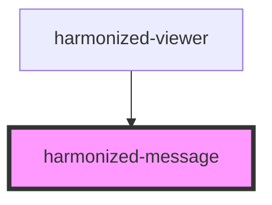

# harmonized-viewer-message

<!-- Auto Generated Below -->

## Properties

| Property | Attribute | Description | Type                                | Default     |
| -------- | --------- | ----------- | ----------------------------------- | ----------- |
| `text`   | `text`    |             | `string`                            | `undefined` |
| `type`   | `type`    |             | `"default" \| "error" \| "success"` | `undefined` |

## Dependencies

### Used by

 - [harmonized-viewer](../viewer-component)

### Graph

----------------------------------------------

*Built with [StencilJS](https://stenciljs.com/)*
