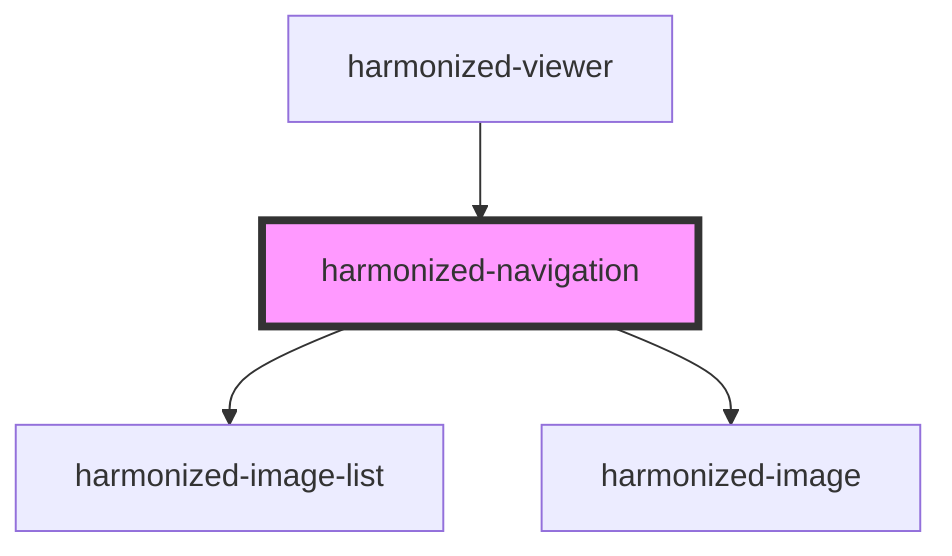

# hv-navigation

<!-- Auto Generated Below -->

## Properties

| Property     | Attribute     | Description | Type      | Default |
| ------------ | ------------- | ----------- | --------- | ------- |
| `autoResize` | `auto-resize` |             | `boolean` | `false` |
| `cols`       | `cols`        |             | `number`  | `10`    |
| `rows`       | `rows`        |             | `number`  | `1`     |

## Events

| Event                 | Description | Type               |
| --------------------- | ----------- | ------------------ |
| `hvNavigationUpdated` |             | `CustomEvent<any>` |

## Dependencies

### Used by

 - [harmonized-viewer](../viewer-component)

### Depends on

- [harmonized-image-list](../image-list)
- [harmonized-image](../image)

### Graph

----------------------------------------------

*Built with [StencilJS](https://stenciljs.com/)*
