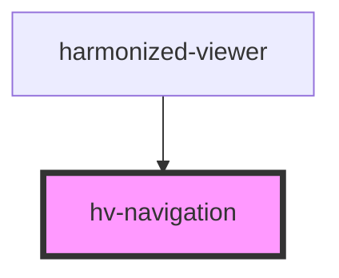

# hv-navigation

<!-- Auto Generated Below -->

## Properties

| Property   | Attribute | Description | Type        | Default     |
| ---------- | --------- | ----------- | ----------- | ----------- |
| `manifest` | --        |             | `IManifest` | `undefined` |
| `page`     | `page`    |             | `number`    | `0`         |

## Events

| Event  | Description | Type               |
| ------ | ----------- | ------------------ |
| `goto` |             | `CustomEvent<any>` |

## Dependencies

### Used by

 - [harmonized-viewer](../viewer-component)

### Graph

----------------------------------------------

*Built with [StencilJS](https://stenciljs.com/)*
