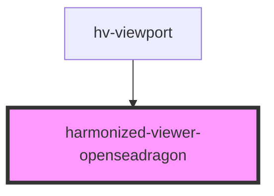

# harmonized-viewer-openseadragon

<!-- Auto Generated Below -->

## Events

| Event          | Description | Type               |
| -------------- | ----------- | ------------------ |
| `overlayClick` |             | `CustomEvent<any>` |

## Methods

### `getOverlays() => Promise<Overlay[]>`

#### Returns

Type: `Promise<Overlay[]>`

## Dependencies

### Used by

 - [hv-viewport](../viewport-component)

### Graph

----------------------------------------------

*Built with [StencilJS](https://stenciljs.com/)*
