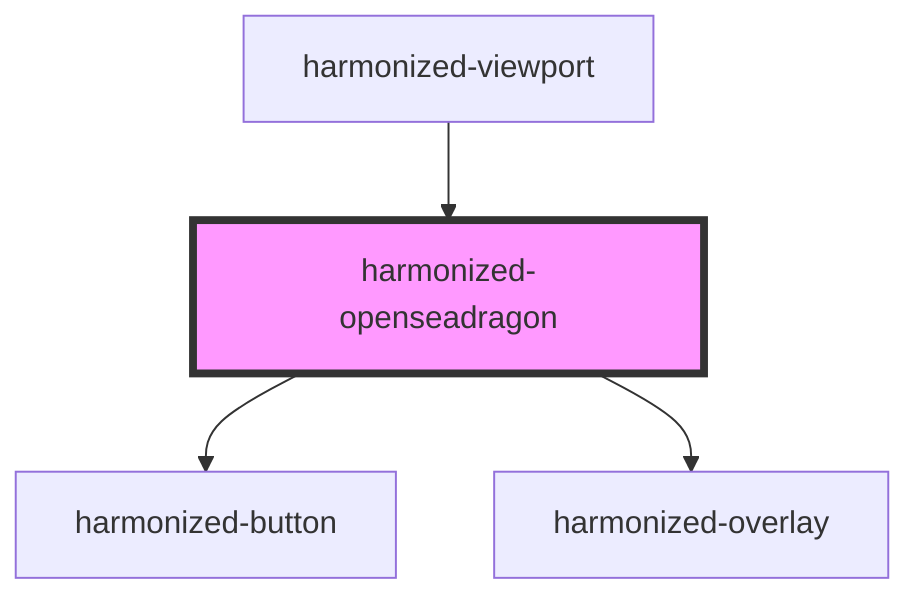

# harmonized-viewer-openseadragon

<!-- Auto Generated Below -->

## Properties

| Property      | Attribute      | Description | Type      | Default |
| ------------- | -------------- | ----------- | --------- | ------- |
| `allowPaging` | `allow-paging` |             | `boolean` | `true`  |

## Events

| Event          | Description | Type               |
| -------------- | ----------- | ------------------ |
| `overlayClick` |             | `CustomEvent<any>` |
| `pageLoad`     |             | `CustomEvent<any>` |

## Methods

### `getOverlays() => Promise<DocumentOverlay[]>`

#### Returns

Type: `Promise<DocumentOverlay[]>`

### `openseadragon() => Promise<any>`

#### Returns

Type: `Promise<any>`

## Dependencies

### Used by

 - [harmonized-viewport](../viewport-component)

### Depends on

- [harmonized-button](../button)
- [harmonized-overlay](../overlay)

### Graph

----------------------------------------------

*Built with [StencilJS](https://stenciljs.com/)*
