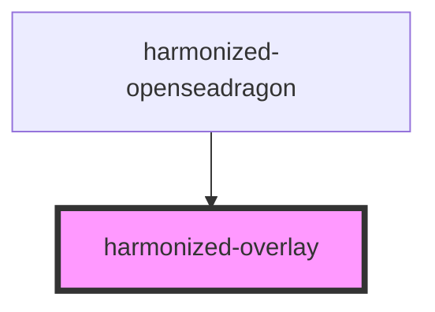

# harmonized-overlay

<!-- Auto Generated Below -->

## Properties

| Property       | Attribute       | Description | Type     | Default     |
| -------------- | --------------- | ----------- | -------- | ----------- |
| `height`       | `height`        |             | `number` | `undefined` |
| `mouseTracker` | `mouse-tracker` |             | `any`    | `undefined` |
| `width`        | `width`         |             | `number` | `undefined` |
| `x`            | `x`             |             | `number` | `undefined` |
| `y`            | `y`             |             | `number` | `undefined` |

## Dependencies

### Used by

 - [harmonized-openseadragon](../openseadragon)

### Graph

----------------------------------------------

*Built with [StencilJS](https://stenciljs.com/)*
