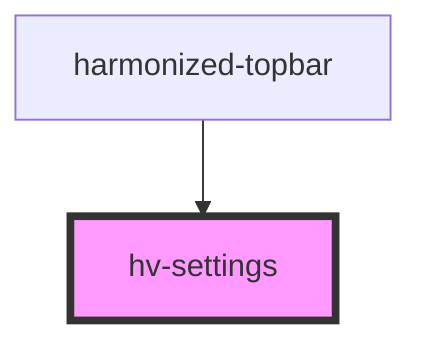

# hv-settings

<!-- Auto Generated Below -->

## Dependencies

### Used by

 - [harmonized-topbar](../topbar)

### Graph

----------------------------------------------

*Built with [StencilJS](https://stenciljs.com/)*
