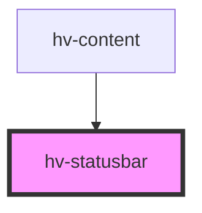

# hv-statusbar

<!-- Auto Generated Below -->

## Dependencies

### Used by

 - [hv-content](../content-component)

### Graph

----------------------------------------------

*Built with [StencilJS](https://stenciljs.com/)*
