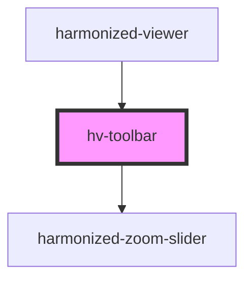

# hv-toolbar

<!-- Auto Generated Below -->

## Dependencies

### Used by

 - [harmonized-viewer](../viewer-component)

### Depends on

- [harmonized-zoom-slider](../zoom-slider)

### Graph

----------------------------------------------

*Built with [StencilJS](https://stenciljs.com/)*
