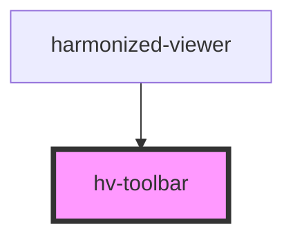

# hv-toolbar

<!-- Auto Generated Below -->

## Properties

| Property     | Attribute     | Description | Type     | Default     |
| ------------ | ------------- | ----------- | -------- | ----------- |
| `page`       | `page`        |             | `number` | `undefined` |
| `totalPages` | `total-pages` |             | `number` | `undefined` |

## Events

| Event      | Description | Type               |
| ---------- | ----------- | ------------------ |
| `next`     |             | `CustomEvent<any>` |
| `previous` |             | `CustomEvent<any>` |

## Dependencies

### Used by

 - [harmonized-viewer](../viewer-component)

### Graph

----------------------------------------------

*Built with [StencilJS](https://stenciljs.com/)*
