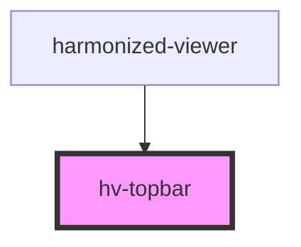

# hv-topbar

<!-- Auto Generated Below -->

## Properties

| Property    | Attribute   | Description | Type     | Default     |
| ----------- | ----------- | ----------- | -------- | ----------- |
| `publisher` | `publisher` |             | `string` | `undefined` |
| `thumbnail` | `thumbnail` |             | `string` | `undefined` |
| `title`     | `title`     |             | `string` | `undefined` |

## Events

| Event               | Description | Type               |
| ------------------- | ----------- | ------------------ |
| `navigationToggled` |             | `CustomEvent<any>` |

## Dependencies

### Used by

 - [harmonized-viewer](../viewer-component)

### Graph

----------------------------------------------

*Built with [StencilJS](https://stenciljs.com/)*
