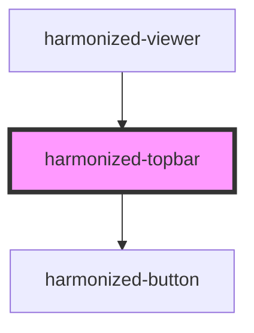

# harmonized-viewer-topbar

<!-- Auto Generated Below -->

## Events

| Event                           | Description | Type               |
| ------------------------------- | ----------- | ------------------ |
| `_hvFullscreenToggle`           |             | `CustomEvent<any>` |
| `harmonizedViewerTopBarUpdated` |             | `CustomEvent<any>` |

## Dependencies

### Used by

 - [harmonized-viewer](../viewer-component)

### Depends on

- [harmonized-button](../button)

### Graph

----------------------------------------------

*Built with [StencilJS](https://stenciljs.com/)*
