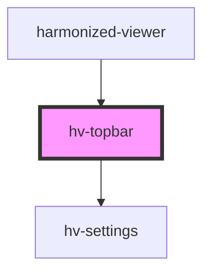

# hv-topbar

<!-- Auto Generated Below -->

## Properties

| Property   | Attribute | Description | Type        | Default     |
| ---------- | --------- | ----------- | ----------- | ----------- |
| `manifest` | --        |             | `IManifest` | `undefined` |

## Dependencies

### Used by

 - [harmonized-viewer](../viewer-component)

### Depends on

- [hv-settings](../settings)

### Graph

----------------------------------------------

*Built with [StencilJS](https://stenciljs.com/)*
