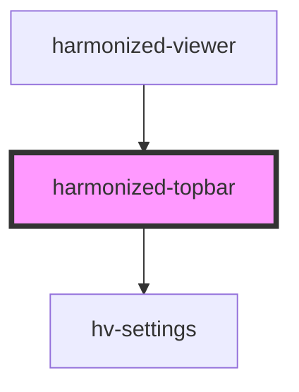

# harmonized-viewer-topbar

<!-- Auto Generated Below -->

## Dependencies

### Used by

 - [harmonized-viewer](../viewer-component)

### Depends on

- [hv-settings](../settings)

### Graph

----------------------------------------------

*Built with [StencilJS](https://stenciljs.com/)*
