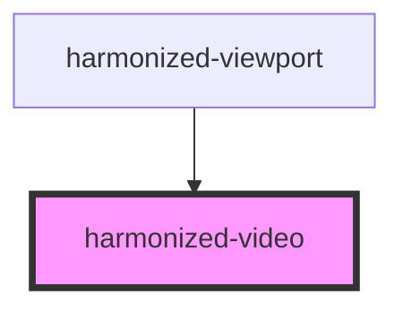

# harmonized-video

<!-- Auto Generated Below -->

## Properties

| Property      | Attribute      | Description | Type     | Default     |
| ------------- | -------------- | ----------- | -------- | ----------- |
| `contentType` | `content-type` |             | `string` | `undefined` |
| `url`         | `url`          |             | `string` | `undefined` |

## Events

| Event                       | Description | Type               |
| --------------------------- | ----------- | ------------------ |
| `hvCustomVideoPlayerRender` |             | `CustomEvent<any>` |

## Dependencies

### Used by

 - [harmonized-viewport](../viewport-component)

### Graph

----------------------------------------------

*Built with [StencilJS](https://stenciljs.com/)*
