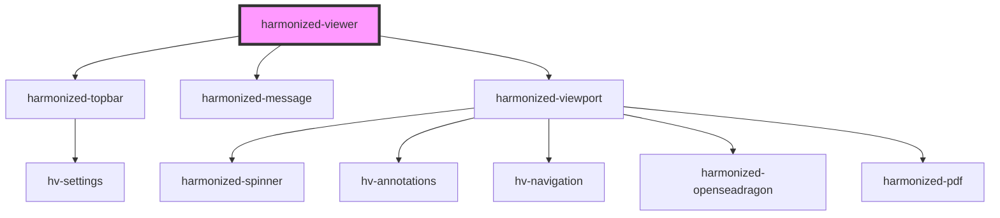

# harmonized-viewer

<!-- Auto Generated Below -->

## Properties

| Property             | Attribute             | Description | Type                                     | Default     |
| -------------------- | --------------------- | ----------- | ---------------------------------------- | ----------- |
| `annotationsEnable`  | `annotations-enable`  |             | `boolean`                                | `undefined` |
| `documentUrl`        | `url`                 |             | `string`                                 | `undefined` |
| `language`           | `language`            |             | `string`                                 | `undefined` |
| `navigationEnable`   | `navigation-enable`   |             | `boolean`                                | `undefined` |
| `navigationHeight`   | `navigation-height`   |             | `number`                                 | `undefined` |
| `navigationLocation` | `navigation-location` |             | `"bottom" \| "left" \| "right" \| "top"` | `undefined` |

## Dependencies

### Depends on

- [harmonized-topbar](../topbar)
- [harmonized-message](../message-component)
- [harmonized-viewport](../viewport-component)

### Graph

----------------------------------------------

*Built with [StencilJS](https://stenciljs.com/)*
