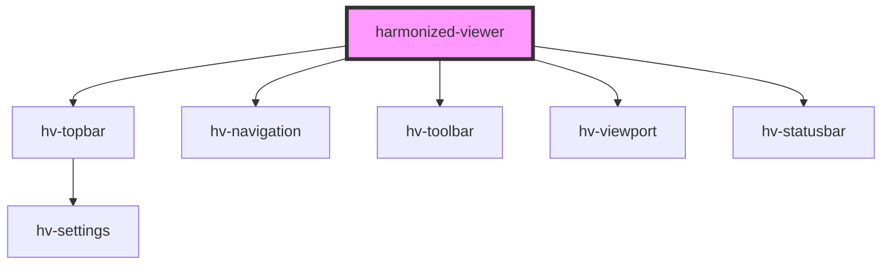

# harmonized-viewer

<!-- Auto Generated Below -->

## Properties

| Property     | Attribute | Description | Type                      | Default     |
| ------------ | --------- | ----------- | ------------------------- | ----------- |
| `manifest`   | --        |             | `IManifest`               | `undefined` |
| `navigation` | --        |             | `HTMLHvNavigationElement` | `undefined` |
| `topbar`     | --        |             | `HTMLHvTopbarElement`     | `undefined` |
| `viewport`   | --        |             | `HTMLHvViewportElement`   | `undefined` |

## Events

| Event            | Description | Type               |
| ---------------- | ----------- | ------------------ |
| `goto`           |             | `CustomEvent<any>` |
| `manifestLoaded` |             | `CustomEvent<any>` |

## Dependencies

### Depends on

- [hv-topbar](../topbar-component)
- [hv-navigation](../navigation)
- [hv-toolbar](../toolbar)
- [hv-viewport](../viewport-component)
- [hv-statusbar](../statusbar)

### Graph

----------------------------------------------

*Built with [StencilJS](https://stenciljs.com/)*
