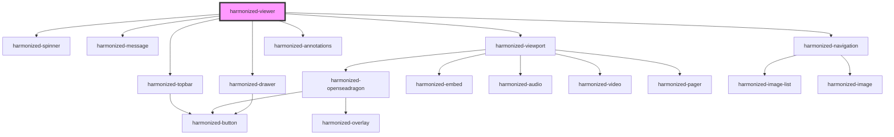

# harmonized-viewer

<!-- Auto Generated Below -->

## Properties

| Property                    | Attribute                     | Description | Type                                     | Default     |
| --------------------------- | ----------------------------- | ----------- | ---------------------------------------- | ----------- |
| `customItemProps`           | --                            |             | `string[]`                               | `[]`        |
| `customVideoPlayer`         | `customvideoplayer`           |             | `boolean`                                | `false`     |
| `deepzoomEnabled`           | `deepzoom`                    |             | `boolean`                                | `true`      |
| `language`                  | `language`                    |             | `string`                                 | `undefined` |
| `navigationBackgroundColor` | `navigation-background-color` |             | `string`                                 | `undefined` |
| `navigationCols`            | `navigation-cols`             |             | `number`                                 | `16`        |
| `navigationEnable`          | `navigation-enable`           |             | `boolean`                                | `undefined` |
| `navigationPlacement`       | `navigation-placement`        |             | `"bottom" \| "left" \| "right" \| "top"` | `"bottom"`  |
| `navigationRows`            | `navigation-rows`             |             | `number`                                 | `1`         |
| `preventLoadOnEmpty`        | `prevent-load-on-empty`       |             | `boolean`                                | `false`     |
| `suppressGallery`           | `suppress-gallery`            |             | `boolean`                                | `false`     |
| `url`                       | `url`                         |             | `string`                                 | `undefined` |

## Events

| Event               | Description | Type               |
| ------------------- | ----------- | ------------------ |
| `hvManifestError`   |             | `CustomEvent<any>` |
| `hvManifestIsEmpty` |             | `CustomEvent<any>` |
| `hvRender`          |             | `CustomEvent<any>` |
| `itemChanged`       |             | `CustomEvent<any>` |
| `itemsLoaded`       |             | `CustomEvent<any>` |

## Methods

### `addOverlay(x: number, y: number, width: number, height: number) => Promise<void>`

#### Returns

Type: `Promise<void>`

### `getCurrentItem() => Promise<Item>`

#### Returns

Type: `Promise<Item>`

### `getCustomVideoElement() => Promise<HTMLElement>`

#### Returns

Type: `Promise<HTMLElement>`

### `getDrawerElement() => Promise<HTMLElement>`

#### Returns

Type: `Promise<HTMLElement>`

### `getItemCount() => Promise<number>`

#### Returns

Type: `Promise<number>`

### `getItems() => Promise<Item[]>`

#### Returns

Type: `Promise<Item[]>`

### `getNavigationElement() => Promise<HTMLElement>`

#### Returns

Type: `Promise<HTMLElement>`

### `getTopBarElement() => Promise<HTMLElement>`

#### Returns

Type: `Promise<HTMLElement>`

### `getViewportElement() => Promise<HTMLElement>`

#### Returns

Type: `Promise<HTMLElement>`

### `getViewportType() => Promise<ViewportType>`

#### Returns

Type: `Promise<ViewportType>`

### `setItem(index: number) => Promise<boolean>`

#### Returns

Type: `Promise<boolean>`

## Dependencies

### Depends on

- [harmonized-spinner](../spinner)
- [harmonized-message](../message)
- [harmonized-topbar](../topbar)
- [harmonized-viewport](../viewport-component)
- [harmonized-navigation](../navigation)
- [harmonized-drawer](../drawer)
- [harmonized-annotations](../annotations)

### Graph

----------------------------------------------

*Built with [StencilJS](https://stenciljs.com/)*
