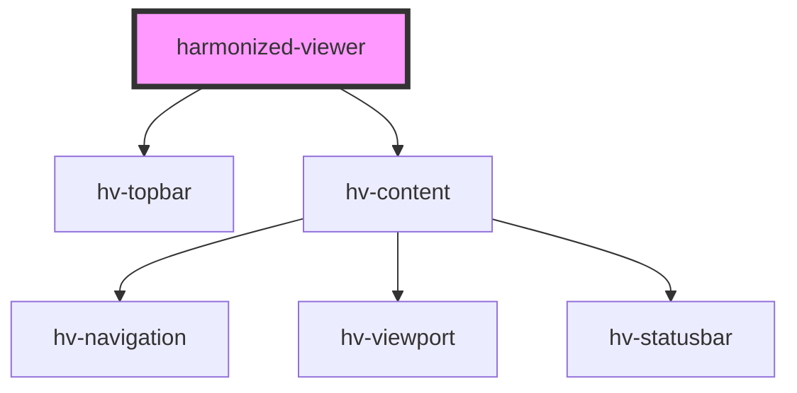

# harmonized-viewer

<!-- Auto Generated Below -->

## Properties

| Property     | Attribute | Description | Type                      | Default     |
| ------------ | --------- | ----------- | ------------------------- | ----------- |
| `navigation` | --        |             | `HTMLHvNavigationElement` | `undefined` |
| `topbar`     | --        |             | `HTMLHvTopbarElement`     | `undefined` |

## Dependencies

### Depends on

- [hv-topbar](../topbar-component)
- [hv-content](../content-component)

### Graph

----------------------------------------------

*Built with [StencilJS](https://stenciljs.com/)*
