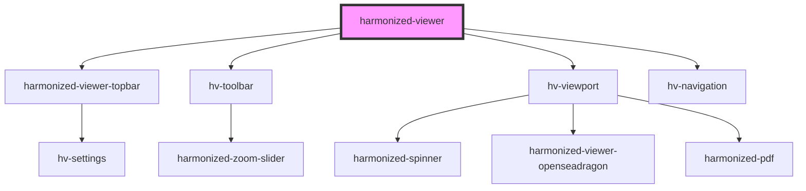

# harmonized-viewer

<!-- Auto Generated Below -->

## Properties

| Property             | Attribute             | Description | Type                                                                                         | Default               |
| -------------------- | --------------------- | ----------- | -------------------------------------------------------------------------------------------- | --------------------- |
| `annotationsShow`    | `annotations-show`    |             | `boolean`                                                                                    | `true`                |
| `enableNavigation`   | `enable-navigation`   |             | `boolean`                                                                                    | `true`                |
| `enableToolbar`      | `enable-toolbar`      |             | `boolean`                                                                                    | `true`                |
| `enableTopbar`       | `enable-topbar`       |             | `boolean`                                                                                    | `true`                |
| `language`           | `language`            |             | `string`                                                                                     | `"en"`                |
| `navigationHeight`   | `navigation-height`   |             | `number`                                                                                     | `null`                |
| `navigationLocation` | `navigation-location` |             | `LocationOption.Bottom \| LocationOption.Left \| LocationOption.Right \| LocationOption.Top` | `LocationOption.Left` |
| `page`               | `page`                |             | `number`                                                                                     | `undefined`           |
| `parameterUrl`       | `url`                 |             | `string`                                                                                     | `undefined`           |
| `totalPages`         | `total-pages`         |             | `number`                                                                                     | `undefined`           |

## Events

| Event            | Description | Type               |
| ---------------- | ----------- | ------------------ |
| `canvasLoaded`   |             | `CustomEvent<any>` |
| `goto`           |             | `CustomEvent<any>` |
| `manifestLoaded` |             | `CustomEvent<any>` |
| `nextLoad`       |             | `CustomEvent<any>` |

## Dependencies

### Depends on

- [harmonized-viewer-topbar](../topbar)
- [hv-toolbar](../toolbar)
- [hv-viewport](../viewport-component)
- [hv-navigation](../navigation)

### Graph

----------------------------------------------

*Built with [StencilJS](https://stenciljs.com/)*
