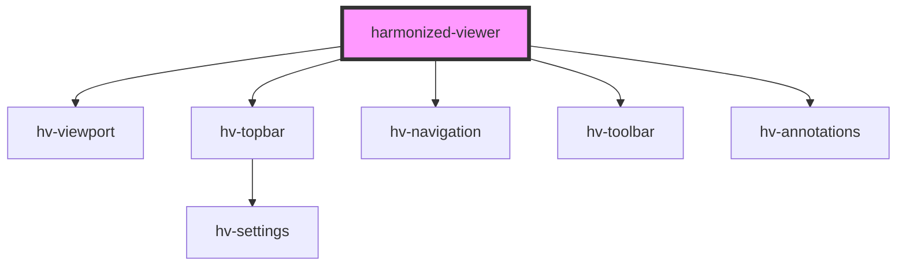

# harmonized-viewer

<!-- Auto Generated Below -->

## Properties

| Property             | Attribute             | Description | Type                                                                                         | Default               |
| -------------------- | --------------------- | ----------- | -------------------------------------------------------------------------------------------- | --------------------- |
| `annotations`        | --                    |             | `HTMLHvAnnotationsElement`                                                                   | `undefined`           |
| `annotationsShow`    | `annotations-show`    |             | `boolean`                                                                                    | `true`                |
| `manifest`           | --                    |             | `IManifest`                                                                                  | `undefined`           |
| `navigationElement`  | --                    |             | `HTMLHvNavigationElement`                                                                    | `undefined`           |
| `navigationHeight`   | `navigation-height`   |             | `number`                                                                                     | `200`                 |
| `navigationLocation` | `navigation-location` |             | `LocationOption.Bottom \| LocationOption.Left \| LocationOption.Right \| LocationOption.Top` | `LocationOption.Left` |
| `page`               | `page`                |             | `number`                                                                                     | `undefined`           |
| `toolbar`            | --                    |             | `HTMLHvToolbarElement`                                                                       | `undefined`           |
| `toolbarShow`        | `toolbar-show`        |             | `boolean`                                                                                    | `true`                |
| `topbar`             | --                    |             | `HTMLHvTopbarElement`                                                                        | `undefined`           |
| `topbarShow`         | `topbar-show`         |             | `boolean`                                                                                    | `true`                |
| `totalPages`         | `total-pages`         |             | `number`                                                                                     | `undefined`           |
| `url`                | `url`                 |             | `string`                                                                                     | `undefined`           |
| `viewport`           | --                    |             | `HTMLHvViewportElement`                                                                      | `undefined`           |

## Events

| Event            | Description | Type               |
| ---------------- | ----------- | ------------------ |
| `goto`           |             | `CustomEvent<any>` |
| `manifestLoaded` |             | `CustomEvent<any>` |

## Methods

### `currentPage() => Promise<number>`

#### Returns

Type: `Promise<number>`

### `next() => Promise<void>`

#### Returns

Type: `Promise<void>`

## Dependencies

### Depends on

- [hv-viewport](../viewport-component)
- [hv-topbar](../topbar)
- [hv-navigation](../navigation)
- [hv-toolbar](../toolbar)
- [hv-annotations](../annotations)

### Graph

----------------------------------------------

*Built with [StencilJS](https://stenciljs.com/)*
