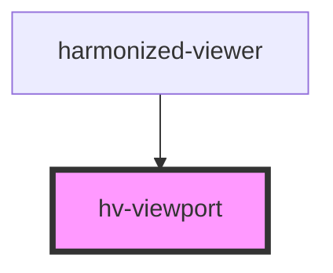

# hv-viewport

<!-- Auto Generated Below -->

## Properties

| Property        | Attribute       | Description | Type     | Default     |
| --------------- | --------------- | ----------- | -------- | ----------- |
| `manifest`      | `manifest`      |             | `string` | `undefined` |
| `openseadragon` | `openseadragon` |             | `any`    | `undefined` |
| `page`          | `page`          |             | `number` | `0`         |
| `totalPages`    | `total-pages`   |             | `number` | `0`         |

## Events

| Event            | Description | Type               |
| ---------------- | ----------- | ------------------ |
| `canvasLoaded`   |             | `CustomEvent<any>` |
| `manifestLoaded` |             | `CustomEvent<any>` |
| `pageLoaded`     |             | `CustomEvent<any>` |

## Dependencies

### Used by

 - [harmonized-viewer](../viewer-component)

### Graph

----------------------------------------------

*Built with [StencilJS](https://stenciljs.com/)*
