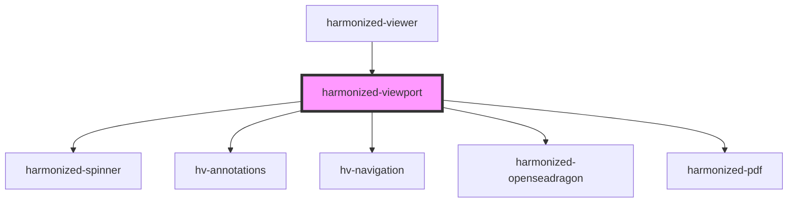

# hv-viewport

<!-- Auto Generated Below -->

## Properties

| Property             | Attribute             | Description | Type                                     | Default  |
| -------------------- | --------------------- | ----------- | ---------------------------------------- | -------- |
| `annotationsEnable`  | `annotations-enable`  |             | `boolean`                                | `false`  |
| `navigationEnable`   | `navigation-enable`   |             | `boolean`                                | `true`   |
| `navigationLocation` | `navigation-location` |             | `"bottom" \| "left" \| "right" \| "top"` | `'left'` |

## Dependencies

### Used by

 - [harmonized-viewer](../viewer-component)

### Depends on

- [harmonized-spinner](../spinner)
- [hv-annotations](../annotations)
- [hv-navigation](../navigation)
- [harmonized-openseadragon](../openseadragon)
- [harmonized-pdf](../pdf)

### Graph

----------------------------------------------

*Built with [StencilJS](https://stenciljs.com/)*
