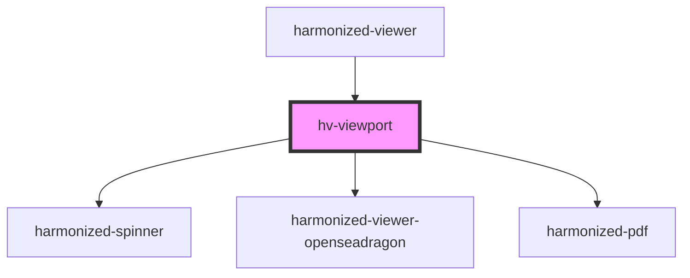

# hv-viewport

<!-- Auto Generated Below -->

## Dependencies

### Used by

 - [harmonized-viewer](../viewer-component)

### Depends on

- [harmonized-spinner](../spinner)
- [harmonized-viewer-openseadragon](../openseadragon)
- [harmonized-pdf](../pdf)

### Graph

----------------------------------------------

*Built with [StencilJS](https://stenciljs.com/)*
