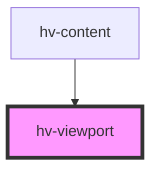

# hv-viewport

<!-- Auto Generated Below -->

## Properties

| Property        | Attribute       | Description | Type     | Default     |
| --------------- | --------------- | ----------- | -------- | ----------- |
| `manifest`      | `manifest`      |             | `string` | `undefined` |
| `openseadragon` | `openseadragon` |             | `any`    | `undefined` |

## Events

| Event            | Description | Type               |
| ---------------- | ----------- | ------------------ |
| `canvasLoaded`   |             | `CustomEvent<any>` |
| `manifestLoaded` |             | `CustomEvent<any>` |

## Dependencies

### Used by

 - [hv-content](../content-component)

### Graph

----------------------------------------------

*Built with [StencilJS](https://stenciljs.com/)*
