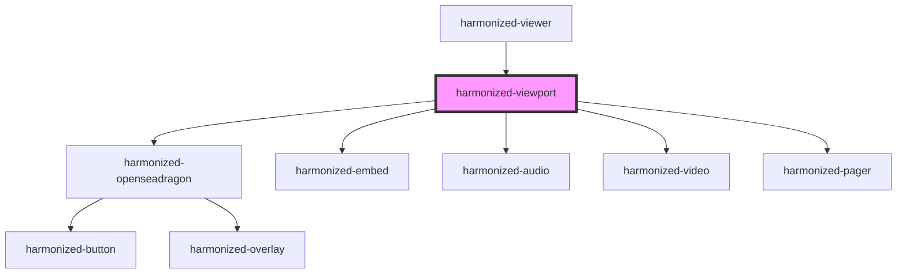

# hv-viewport

<!-- Auto Generated Below -->

## Events

| Event                             | Description | Type               |
| --------------------------------- | ----------- | ------------------ |
| `harmonizedViewerViewportUpdated` |             | `CustomEvent<any>` |

## Dependencies

### Used by

 - [harmonized-viewer](../viewer-component)

### Depends on

- [harmonized-openseadragon](../openseadragon)
- [harmonized-embed](../pdf)
- [harmonized-audio](../audio-component)
- [harmonized-video](../video)
- [harmonized-pager](../pager)

### Graph

----------------------------------------------

*Built with [StencilJS](https://stenciljs.com/)*
